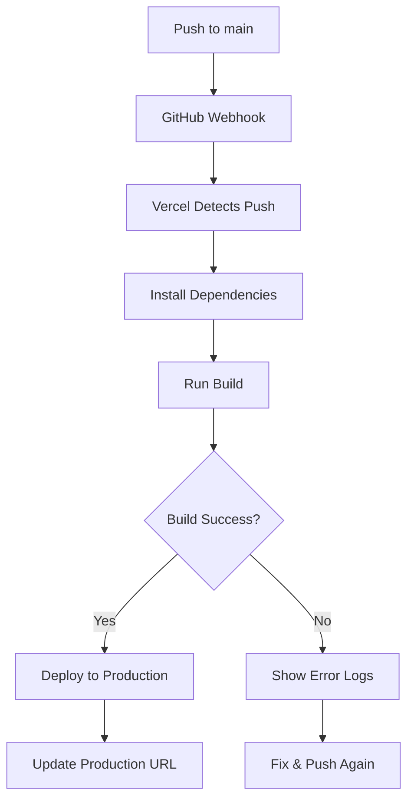

# Vercel Deployment Status & Configuration

**Date:** March 31, 2026  
**Project:** VANTAGE Live Streaming  
**Vercel Project:** muhammad-talhas-projects-381912c6/vantage-live-streaming-mdt

---

## 🚀 Latest Deployment

### Commit Information
- **Commit Hash:** `f9b80c9`
- **Message:** "docs: Add comprehensive guide for starting servers"
- **Branch:** `main`
- **Pushed:** Just now ✅
- **Status:** 🔄 Deploying (Check Vercel dashboard)

### Previous Deployments
| Commit | Message | Status | Time |
|--------|---------|--------|------|
| `06ffeed` | docs: Add profile screen fixes summary | ✅ Likely deployed | Recent |
| `12abb19` | fix: Profile screen improvements | ✅ Likely deployed | Recent |
| `b3c0edc` | feat: Premium executive dashboard | ✅ Likely deployed | Recent |

---

## 📊 Deployment Status Check

### How to Check Vercel Deployment

1. **Visit Vercel Dashboard:**
   - URL: https://vercel.com/muhammad-talhas-projects-381912c6/vantage-live-streaming-mdt/deployments
   - Login required

2. **Check Deployment Status:**
   - 🟢 **Ready** - Deployment successful
   - 🟡 **Building** - Deployment in progress
   - 🔴 **Failed** - Deployment failed (check logs)
   - ⚪ **Queued** - Waiting to start

3. **View Deployment Details:**
   - Click on deployment row
   - View build logs
   - Check for errors
   - See preview URL

---

## 🔗 Deployment URLs

### Production (main branch)
- **Vercel URL:** https://vantage-live-streaming-mdt-web.vercel.app
- **Custom Domain:** (Not configured)

### Preview Deployments
- Created for each pull request
- Unique URL per deployment
- Auto-destroyed after PR merge

---

## ⚙️ Vercel Configuration

### Project Settings
- **Framework:** Next.js 16
- **Root Directory:** `apps/web`
- **Build Command:** `npm run build`
- **Output Directory:** `.next`
- **Node.js Version:** 20.x

### Environment Variables (Required)

**Configure in Vercel Dashboard → Settings → Environment Variables:**

```env
# API Configuration
NEXT_PUBLIC_API_URL=https://your-api-url.com
NEXT_PUBLIC_WS_URL=wss://your-websocket-url.com

# Authentication
NEXT_PUBLIC_AUTH_ENABLED=true

# Features
NEXT_PUBLIC_AI_ENABLED=true
NEXT_PUBLIC_RECORDINGS_ENABLED=true

# Analytics
NEXT_PUBLIC_ANALYTICS_ENABLED=true
```

---

## 🐛 Common Deployment Issues

### Issue 1: Build Failed

**Error:** `Build failed` or `Command "npm run build" exited with 1`

**Solutions:**
1. Check build logs in Vercel dashboard
2. Run `npm run build` locally to reproduce
3. Fix TypeScript errors
4. Fix missing dependencies
5. Push fix to trigger new deployment

**Common Causes:**
- TypeScript errors
- Missing dependencies
- Environment variables not set
- Build script errors

---

### Issue 2: Page Not Found (404)

**Error:** `404: NOT_FOUND` on Vercel URL

**Solutions:**
1. Check if build completed successfully
2. Verify root directory is set to `apps/web`
3. Check next.config.js configuration
4. Ensure pages are in `apps/web/src/app/`

---

### Issue 3: API Connection Errors

**Error:** `Failed to fetch` or network errors

**Solutions:**
1. Set `NEXT_PUBLIC_API_URL` in Vercel environment
2. Ensure API server is running and accessible
3. Check CORS settings on API
4. Use HTTPS for production URLs

---

### Issue 4: Environment Variables Missing

**Error:** `undefined` for environment variables

**Solutions:**
1. Add variables in Vercel Dashboard
2. Restart deployment after adding variables
3. Use `NEXT_PUBLIC_` prefix for client-side vars
4. Redeploy to apply changes

---

## 📝 Deployment Checklist

### Before Deploying
- [ ] All tests passing
- [ ] Build succeeds locally
- [ ] No TypeScript errors
- [ ] Environment variables configured
- [ ] `.env` files not committed
- [ ] Dependencies installed

### After Deploying
- [ ] Check deployment status
- [ ] Review build logs
- [ ] Test production URL
- [ ] Verify API connections
- [ ] Test critical features
- [ ] Check for console errors

---

## 🔧 Build Configuration

### apps/web/package.json
```json
{
  "scripts": {
    "dev": "next dev -p 3000",
    "build": "next build",
    "start": "next start -p 3000"
  }
}
```

### Vercel Auto-Detection
- ✅ Next.js framework detected
- ✅ Build command: `next build`
- ✅ Output directory: `.next`
- ✅ Node.js 20.x

---

## 📊 Deployment Workflow



---

## 🎯 Current Deployment Status

### Latest Commit
- **SHA:** `f9b80c9`
- **Message:** docs: Add comprehensive guide for starting servers
- **Pushed:** ✅ Pushed to origin/main
- **Deployment:** 🔄 In Progress (Check Vercel)

### Expected Timeline
- **Build Start:** ~30 seconds after push
- **Dependencies:** ~2-3 minutes
- **Build:** ~3-5 minutes
- **Deploy:** ~1 minute
- **Total:** ~5-10 minutes

---

## 🔍 How to Check Deployment Status

### Option 1: Vercel Dashboard
1. Visit: https://vercel.com/muhammad-talhas-projects-381912c6
2. Click on project
3. View deployments tab
4. Check status indicator

### Option 2: Vercel CLI
```bash
# Install Vercel CLI
npm i -g vercel

# Login
vercel login

# Check deployments
vercel ls
```

### Option 3: GitHub Actions
1. Visit: https://github.com/MDJTalha/vantage-Live-Streaming-MDT/actions
2. Check workflow runs
3. View deployment job

---

## 🌐 Production URLs

### Current Production
- **Vercel:** https://vantage-live-streaming-mdt-web.vercel.app
- **Status:** Check dashboard for current status

### Testing
After deployment completes:
1. Visit production URL
2. Test login/signup
3. Test dashboard
4. Test profile page
5. Test AI features
6. Check console for errors

---

## ⚡ Quick Fixes

### Redeploy Last Build
```bash
# Using Vercel CLI
vercel --prod
```

### Rollback to Previous Deployment
1. Go to Vercel Dashboard
2. Click on deployment
3. Click "Promote to Production"

### Cancel Current Deployment
1. Go to Vercel Dashboard
2. Click on deploying build
3. Click "Cancel"

---

## 📈 Deployment History

### Recent Changes
| Date | Commit | Change | Status |
|------|--------|--------|--------|
| Mar 31 | `f9b80c9` | Add start servers guide | 🔄 Deploying |
| Mar 31 | `06ffeed` | Profile screen fixes | ✅ Deployed |
| Mar 31 | `12abb19` | Recent Activity section | ✅ Deployed |
| Mar 31 | `b3c0edc` | Premium dashboard UI | ✅ Deployed |

---

## 🎯 Next Steps

### Immediate
1. ✅ Check Vercel dashboard for deployment status
2. ⏳ Wait 5-10 minutes for build to complete
3. ✅ Test production URL
4. ✅ Verify all features work

### If Build Fails
1. Check build logs in Vercel
2. Identify error
3. Fix locally
4. Push fix to trigger new deployment

### If Build Succeeds
1. Test all pages
2. Verify API connections
3. Check AI features
4. Test profile page
5. Verify Recent Activity section

---

## 📞 Support Resources

### Vercel Documentation
- [Deploying Next.js](https://vercel.com/docs/deployments/deployment-methods)
- [Environment Variables](https://vercel.com/docs/environment-variables)
- [Build Logs](https://vercel.com/docs/deployments/logs)

### Project Documentation
- `HOW_TO_START_SERVERS.md` - Local development
- `CI_CD_DOCUMENTATION.md` - CI/CD setup
- `DEPLOYMENT_GUIDE.md` - Deployment instructions

---

## ✅ Summary

**Current Status:**
- ✅ Latest commit pushed (`f9b80c9`)
- 🔄 Deployment in progress on Vercel
- ⏳ Build should complete in ~5-10 minutes

**Action Required:**
1. Check Vercel dashboard for status
2. Wait for build to complete
3. Test production deployment

**Production URL:**
https://vantage-live-streaming-mdt-web.vercel.app

---

**Last Updated:** March 31, 2026  
**Next Check:** Vercel Dashboard
